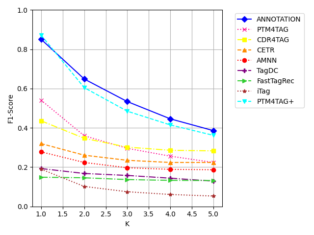
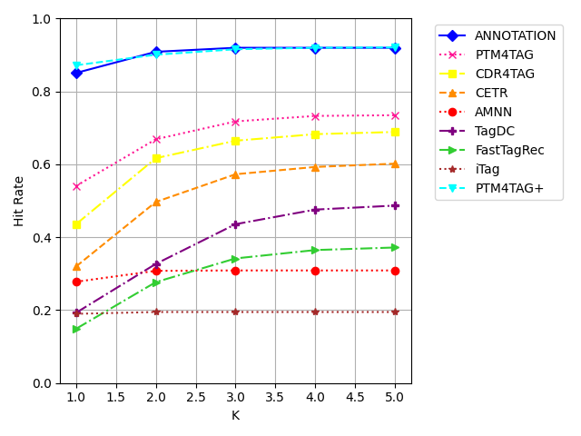
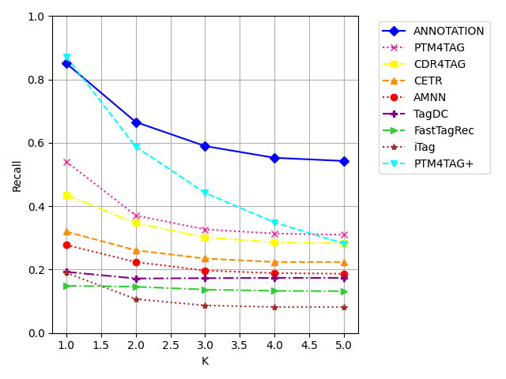
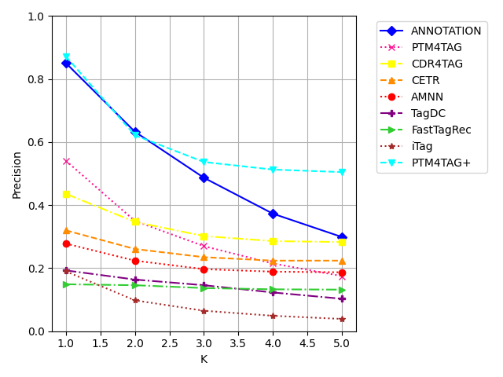

# ANNOTATION: Transformer-aware Sequence-to-Sequence Network for Personalized Tag Recommendation in Software Information Sites

[Pre-print (PDF)](https://jsunchu01.github.io/Annotation-preprint/annotation_preprint.pdf)

## 1. Problem Formulation

The task is to recommend tags for a post on a software Q&A site (Stack Overflow, Code Review). The model takes the post content as input, along with its comments and its author's profile, and generates an ordered sequence of tags as output.

Formally, let each post be a tuple *(title, description, code, comments, user)*, where the user metadata is *(user ID, profile description, badges)*. The goal is to learn a function that maps a post to a tag sequence by maximising the conditional probability of the ground-truth tags:

```
max_f  Σ_i  log P( T_i | title_i, des_i, code_i, cm_i, uid_i, ubdg_i, udes_i )
```

### Input

| Input group | Fields |
|---|---|
| Content | title, description (body text), code snippet |
| Interaction | the comment thread |
| User | user ID, profile "About Me" text, earned badges |

### Datasets

| | Code Review | Stack Overflow |
|---|---|---|
| Posts | 13,111 | 13,295 |
| Distinct tags | 402 | 549 |
| Users | 7,306 | 11,516 |
| Avg. tags / post | 3 | 2.3 |
| Avg. comments / post | 3.2 | 3.5 |
| Max tags / post | 5 | 5 |

---

## 2. Contributions

### 2.1 Tag recommendation as sequence generation

- **Current practice:** Most work treats tagging as multi-label classification, where tags are independent one-hot labels over a fixed list, or as sentence matching, where the post is scored against each candidate tag.
- **Limitation:** Both are bound to a candidate list, so new or composite tags are impossible. Classification ignores tag co-occurrence, and matching captures lexical similarity but not the interdependencies among tags.
- **Our choice:** Generate the tags as a short sequence, where each tag is conditioned on the post and on the tags generated before it. Tags are built from sub-words.
- **Why it is better:** Tags are related (a post on `java`, `algorithm`, `game-theory` and `recursion` needs all four to be consistent), and generation models exactly that. Sub-word decoding lets the model compose tags beyond the training list, which suits a field where new technologies keep appearing.

### 2.2 Comments as context, to fight data sparsity

- **Current practice:** Title, body and code are the only content sources.
- **Limitation:** This is sparse for new or niche topics, and a generic title can hide the real topic.
- **Our choice:** Add the comment thread. Comments clarify the problem, give usage examples and bug reports, propose alternatives, and mention libraries and terms that the post does not. They are sorted by community score, so the most useful comments come first and survive truncation.
- **Why it is better:** The model gets community knowledge and a richer vocabulary at no extra annotation cost, and low-quality comments fall off the end of the sequence instead of diluting the signal.

### 2.3 Personalization from user profile and badges

- **Current practice:** Tag suggestions are generic. Where personalization exists, it comes from a user's tagging history, which is sparse for new users (cold start). In general domains, profiles are interest-driven.
- **Our choice:** Encode the profile description and badges as text, together with the post.
- **Why it is better:** In software communities, badges are community-validated expertise (a "Python gold badge" is a credential, not a preference) and the profile text states domain and interests. Both exist even for a user with no history, so the tags fit the author's domain without needing past posts.

---

## 3. Methodology

**Feature construction.** Comments are sorted by their score (net upvotes) in descending order and concatenated. Badges are de-duplicated and concatenated. All seven fields are truncated or padded to fixed budgets and concatenated into a single input sequence, in the order title, description, code, comments, user ID, profile description, badges.

**Encoder.** CodeBERT (12 layers) processes this sequence and returns hidden states `H = [h_1 … h_L]`. The final state `h_L` summarises the whole post.

**Cross-attention.** At each step *t* the decoder forms a query `q_t` and attends over the encoder output:

```
A_t = softmax( q_t Kᵀ / √d_k ),    c_t = A_t V
```

**Decoder.** GPT-2 generates tags autoregressively. Tags are tokenised with the GPT-2 tokenizer. Generation starts from a BOS token and `h_L`, and masked self-attention stops the decoder from looking ahead. The output distribution is `P(y_t | Y_<t, h_L) = softmax(W_o (W_h h_L + W_y Y_<t + b))`.

**Training.**
- **Loss:** sparse categorical cross-entropy, summed over time steps and averaged over samples: `L_i(t) = −log P(y_t = token_id(tag_it) | Y_<t, h_L)`.
- **Teacher forcing:** the ground-truth previous tag is fed at each step instead of the model's own prediction, which speeds up and stabilises early training.
- **Setup:** Adam optimiser, learning rate 1e-5, batch size 8, one NVIDIA P100 GPU.

**Inference.**
- **Greedy decoding:** `y_t = argmax_v P(v | Y_<t, h_L)`. The model's own previous prediction is fed back as the next input.
- **Stopping:** generation stops at the EOS token or at the maximum length.
- **Output:** the top K = 3 tags are recommended, since K = 3 gave the best F1.

---

## 4. Architecture

The flow from raw post to recommended tags, in order:

```text
                                  Input post
+-------------+ +-------------+ +-------------+ +-------------+ +-------------+
|    Title    | | Description | |    Code     | |  Comments   | |    User     |
+-------------+ +-------------+ +-------------+ +-------------+ +-------------+
       |               |               |               |               |
       +---------------+---------------+---------------+---------------+
                                       |
                                       v
              +-------------------------------------------------+
              |    Sort comments by score, then concatenate     |
              |      De-duplicate badges, then concatenate      |
              +-------------------------------------------------+
                                       |
                                       v
              +-------------------------------------------------+
              |       Tokenise, truncate or pad per field       |
              |  8 / 80 / 100 / 80 / 50 / 25 / 9 = 352 tokens   |
              +-------------------------------------------------+
                                       |
                                       v
              +-------------------------------------------------+
              |          CodeBERT Encoder (12 layers)           |
         +----|      output: hidden states H = h_1 ... h_L      |
         |    +-------------------------------------------------+
         |
    + - -|- - - - - - - - - - - - - - - - - - - - - - - - - - - - - - - - +
    :    |              GPT-2 Decoder (autoregressive)                    :
    :    |                                                                :
    :    |    +-------------------------------------------------+         :
    :    |    |        Masked Multi-Head Self-Attention         |<---+    :
    :  H |    |                 then Add & Norm                 |    |    :
    :    |    +-------------------------------------------------+    |    :
    :    |                             |                             |    :
    :    |                             v                             |    :
    :    |    +-------------------------------------------------+    |    :
    :    +--->|           Multi-Head Cross-Attention            |    |    :
    :         |          K, V from H, then Add & Norm           |    |    :
    :         +-------------------------------------------------+    |    :
    :                                  |                             |    :
    :                                  v                             |    :
    :         +-------------------------------------------------+    ^    :
    :         |                     Softmax                     |    |    :
    :         |       probabilities over GPT-2 vocabulary       |    |    :
    :         +-------------------------------------------------+    |    :
    :                                  |                             |    :
    :                                  v                             |    :
    :         +-------------------------------------------------+    |    :
    :         |     Output: tag sequence y_1, y_2, ..., y_n     |    |    :
    :         |     each y_t is fed back as the next input      |----+    :
    :         +-------------------------------------------------+         :
    :                                                                     :
    :                                                                     :
    + - - - - - - - - - - - - - - - - - - - - - - - - - - - - - - - - - - +
```

---

## 5. Quantitative Results

Metrics are computed at K = 3. Below, ANNOTATION is compared with PTM4Tag+, the strongest baseline.

### Code Review

| Method | Hit rate | Precision | Recall | F1-score | ROUGE-1 | ROUGE-L |
|---|---|---|---|---|---|---|
| PTM4Tag+ | 0.916 | 0.537 | 0.442 | 0.485 | 0.436 | 0.424 |
| ANNOTATION(Ours) | **0.920** | 0.487 |**0.590** | **0.534** | **0.544** | **0.540** |

### Stack Overflow

| Method | Hit rate | Precision | Recall | F1-score | ROUGE-1 | ROUGE-L |
|---|---|---|---|---|---|---|
| PTM4Tag+ | 0.726 | 0.445 | 0.313 | 0.368 | 0.387 | 0.363 |
| ANNOTATION(Ours) | **0.787** | 0.356 | **0.517** | **0.422**| **0.563** | **0.559** |

### Comment embedding variants (Code Review)

| Variant | Hit rate | Precision | Recall | F1-score | ROUGE-1 | ROUGE-L |
|---|---|---|---|---|---|---|
| Average | 0.910 | 0.477 | 0.579 | 0.523 | 0.540 | 0.536 |
| Concatenate (unsorted) | 0.906 | 0.473 | 0.574 | 0.519 | **0.545** | **0.543** |
| Sorted by score, then concatenate | **0.920** | **0.487** | **0.590** | **0.534** | 0.544 | 0.540 |

### Ablation study (Code Review)

| Comments | User | Hit rate | Precision | Recall | F1-score | ROUGE-1 | ROUGE-L |
|---|---|---|---|---|---|---|---|
| no | no | 0.902 | 0.471 | 0.571 | 0.516 | 0.535 | 0.531 |
| no | yes | 0.901 | 0.475 | 0.575 | 0.520 | 0.533 | 0.529 |
| yes | no | 0.912 | 0.475 | 0.577 | 0.521 | **0.544** | **0.540** |
| yes | yes | **0.920** | **0.487** | **0.590** | **0.534** | **0.544** | **0.540** |

### Decoding strategies (Code Review)

| Strategy | Hit rate | Precision | Recall | F1-score | ROUGE-1 | ROUGE-L |
|---|---|---|---|---|---|---|
| Beam | 0.856 | 0.428 | 0.525 | 0.471 | 0.524 | 0.290 |
| Greedy | **0.920** | **0.487** | **0.590** | **0.534** | **0.544** | **0.540** |

---

## 6. Qualitative Results


---

## 7. Graphs

Baseline comparison on Code Review for K = 1 to 5.

<table>
  <tr>
    <td align="center"><b>F1-score</b><br></td>
    <td align="center"><b>Hit rate</b><br></td>
  </tr>
  <tr>
    <td align="center"><b>Recall</b><br></td>
    <td align="center"><b>Precision</b><br></td>
  </tr>
</table>
